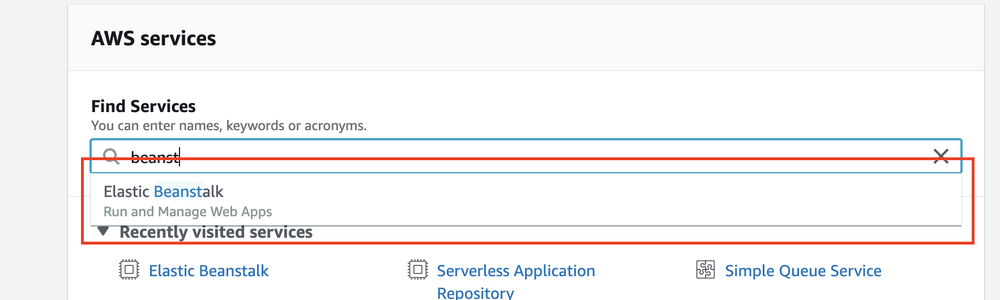
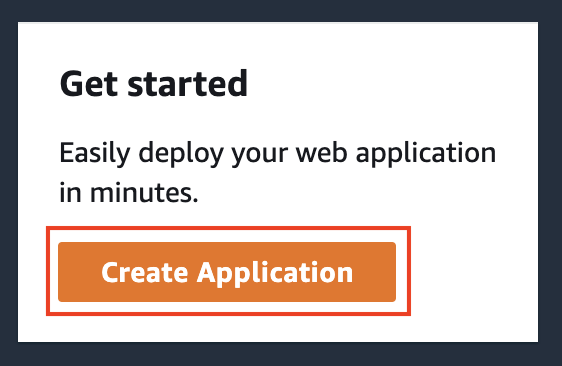
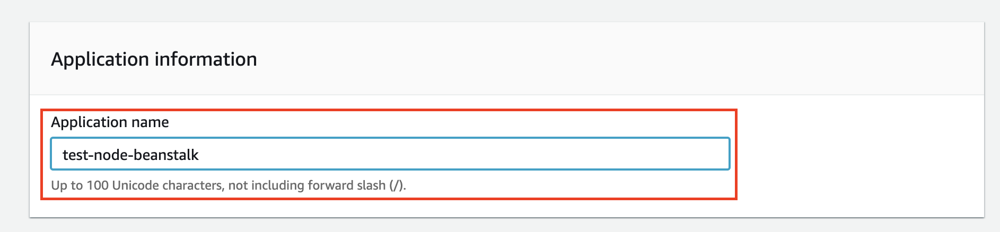
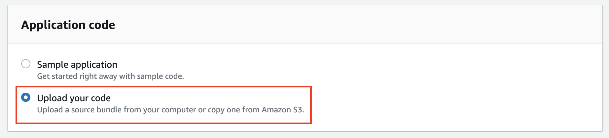
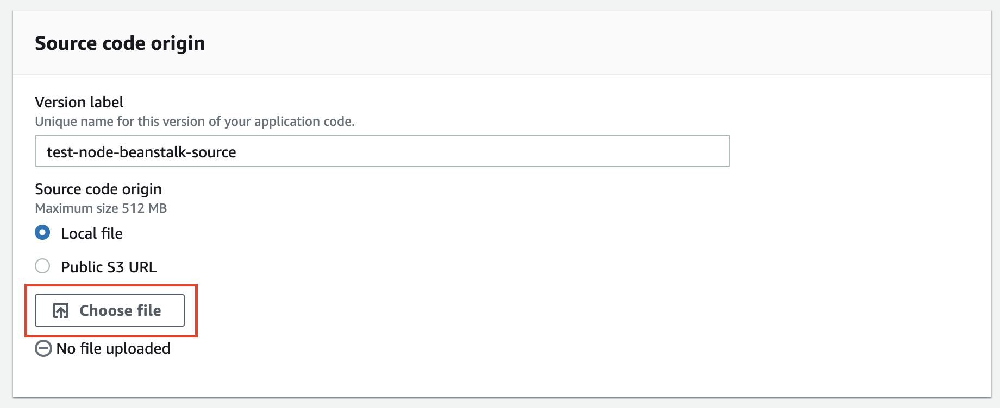
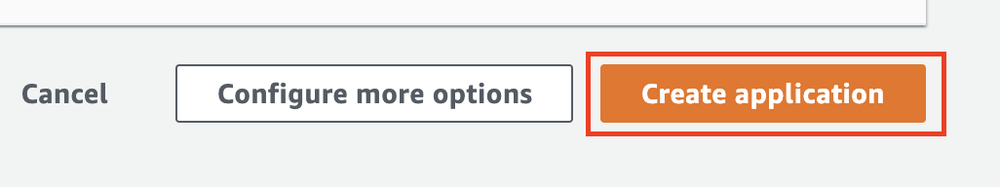
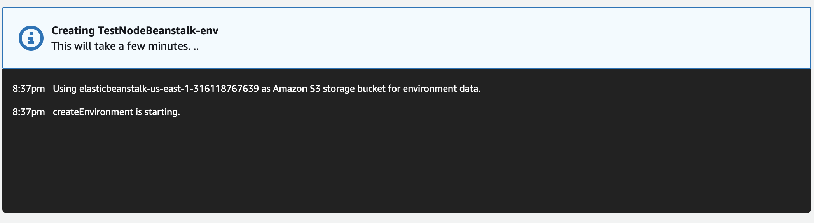
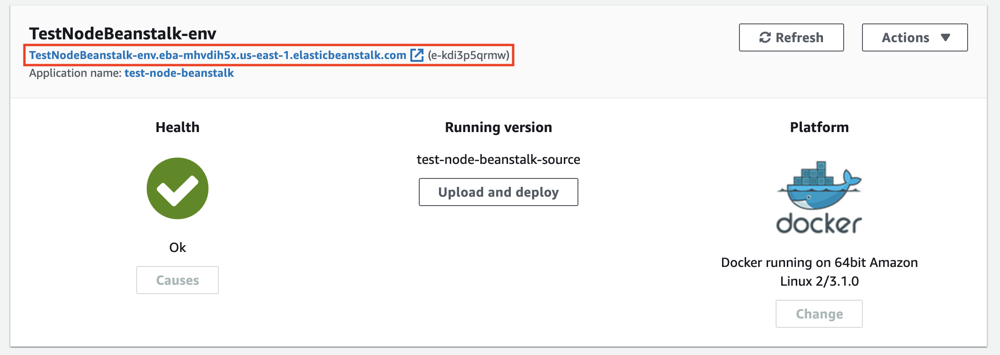

#### Ejemplo despliegue Beanstalk

A continuación se detallan los pasos a seguir para desplegar de una aplicación Node.js sencilla utilizando el servicio AWS Beanstalk

#### AWS Beanstalk

AWS Elastic Beanstalk es un servicio para desplegar aplicaciones web desarrollados con Java, .NET, PHP, Node.js, Python, Ruby, Go y Docker.

Solo se debe cargar el código y Elastic Beanstalk administra de manera automática el despliegue, desde el aprovisionamiento de la capacidad, balanceadores de carga, escalado automático y hasta la monitorización del estado de la aplicación. Al mismo tiempo, se tiene el control de los recursos de AWS que son utilizados por la aplicación pudiendo acceder a los recursos subyacentes.

1. Ingresar a la consola de AWS a través del sitio AWS Educate
2. Seleccionar el servicio "Elastic Beanstalk"

3. Hacer click en "Create Application"

4. Ingresar un nombre de aplicación, ejemplo "test-node-beanstalk"

5. Seleccionar como plataforma a "Docker". Para esto nuestra aplicación tiene que tener definido un *Dockerfile*

6. Seleccionar "Upload your code"

7. Seleccionar "Local file" y hacer click en "Choose file"

**Nota:** Para subir el código debemos generar un archivo *.zip* donde el *Dockerfile* debe estar ubicado en la raiz del archivo a comprimir.

8. Hacer click en "Create application"

9. Una vez lanzado el proceso de creación tenemos que aguardar alrededor de 5 minutos

10. Finalmente hacer click en la URL disponible para acceder a la aplicación desplegada

