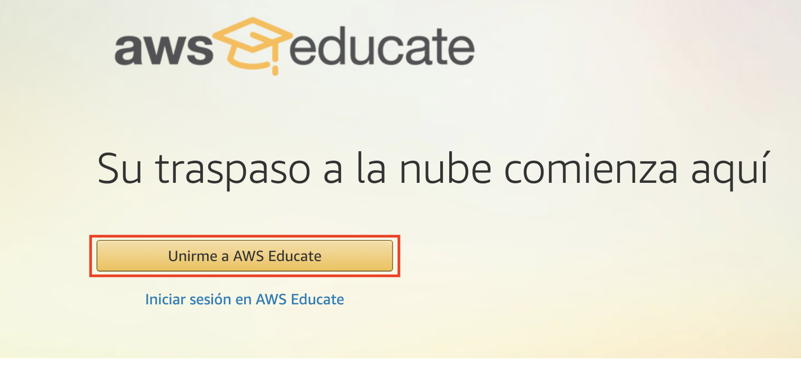
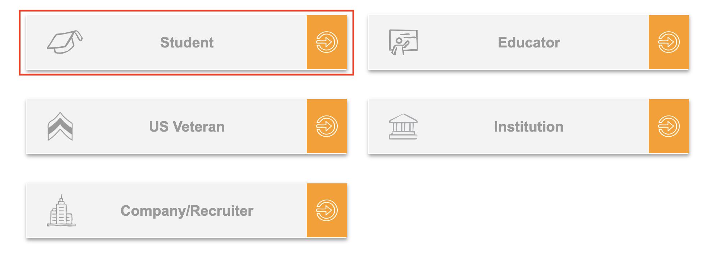
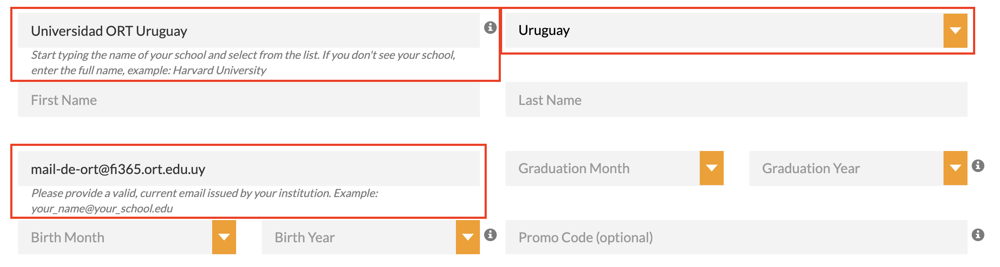
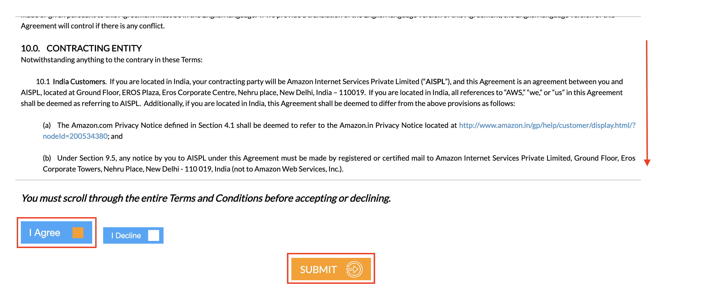
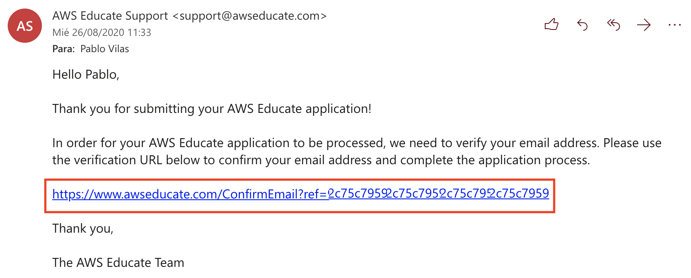

# Arquitectura de Software en la Práctica
## AWS Educate

Este documento describe los pasos a seguir para crear un cuenta en AWS Educate.

1. Ingresar al sitio de [AWS Educate](https://aws.amazon.com/es/education/awseducate/)
2. Hacer click en "Unirme a AWS Educate"

3. Seleccionar la opción "Student"

4. Completar el campo "School or Institution Name" con el valor "Universidad ORT Uruguay" (autocompletable) y el campo "Country" con "Uruguay". A su vez ingresar el mail provisto por facultad con dominio *fi365.ort.edu.uy*

***Nota:*** Se verifica que la universidad y el mail coincidan, por lo que si se utiliza otro mail no provisto por la universidad no se otorgarán los beneficios.

5. Finalmente debe aceptar los términos y condiciones. Hasta que no haga scroll no se habilitará la casilla "I Agree". Una vez leido los términos y condiciones selecionar la casilla "I Agree" y hacer click en "Submit"

6. Completar el proceso verificando su casilla de correo y haciendo click en en enlace de verificación

